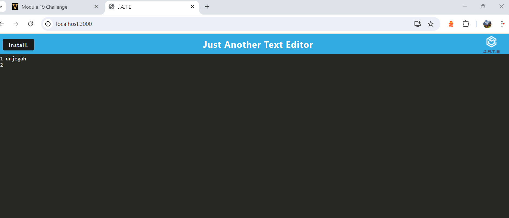
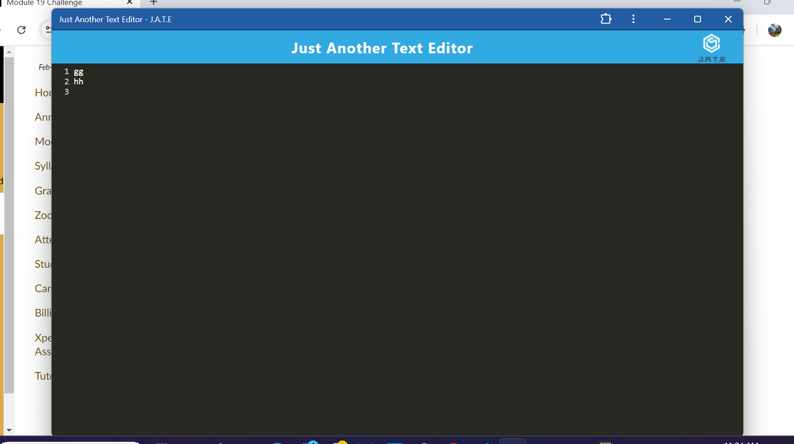

# PWA-Text-Editor
## Description
A progressive web application (PWA) that serves as a text editor. It allows users to create and edit notes or code snippets both online and offline.

## Table of Contents

Title 

Description

Installation

Usage

License

Contributing

Tests

Credits

Author

Questions

### Installation
Clone my repository on GitHub.

To install the application's dependencies and devDependencies, run: 'npm install'

To invoke the application, run: 'npm run start'

### Usage
[Link to install app](https://pwa-text-editor-3-6lhq.onrender.com/)

screenshots.

### Features and Functionalities
This application is developed to allow users to create notes or code snippets with or without an internet connection, so users can reliably retrieve them for later use. It follows the features and functionalities required in the Assignment's README:

* When the user opens the application in the user's editor, the user will see a client server folder structure.

* When the user runs npm run start from the root directory, the application starts up the backend and serve the client.

* When the user runs the text editor application from my terminal, the user will find that the application's JavaScript files have been bundled using webpack.

* When the user runs the webpack plugins, the user will find a generated HTML file, service worker, and a manifest file.

* When the user uses next-gen JavaScript in the application, the text editor still functions in the browser without errors.

* When the user opens the text editor, the user will find the IndexedDB has immediately created a database storage.

* When the user enters content and subsequently clicks off of the DOM window, the content in the text editor is saved with IndexedDB.

* When the user reopens the text editor after closing it, the content in the text editor has been retrieved from the IndexedDB.

* When the user clicks on the Install button, the application is downloaded as an icon on the user's desktop.

* When the user loads the application, the user can register a service worker using workbox.

* When the user registers a service worker, the user's static assets are pre cached upon loading along with subsequent pages and static assets.

* When the user deploys to Heroku, the user has a proper build scripts for a webpack application.

### License
License used for this project - MIT

### Contributing
To contribute to this application: Please email the author for guidelines.

### Tests
During development, the application is tested using localhost.

### Credits
Class material was used as reference when building this API.

### Author
David Waweru

### Questions
For questions or issues, please contact me on my github page
GitHub Username: dnjegah
GitHub Profile: https://github.com/dnjegah